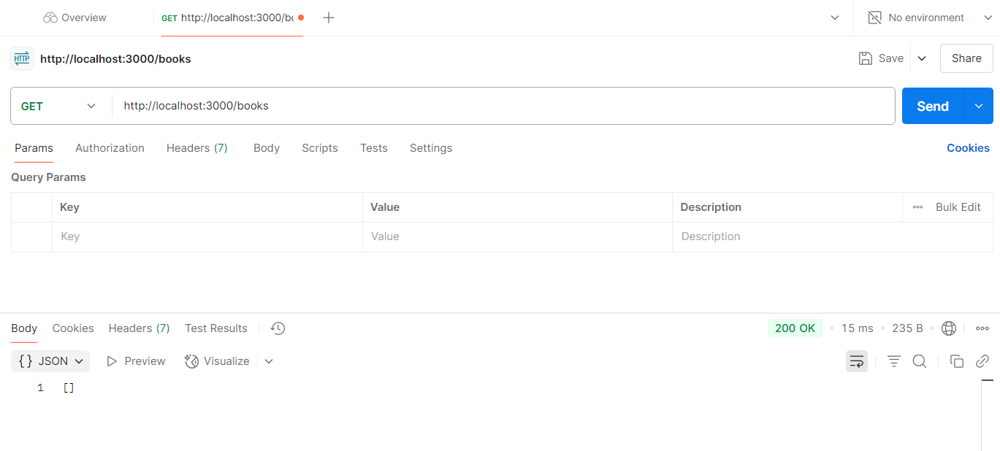
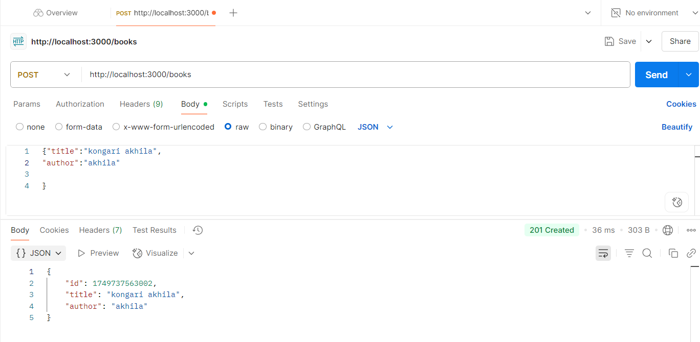
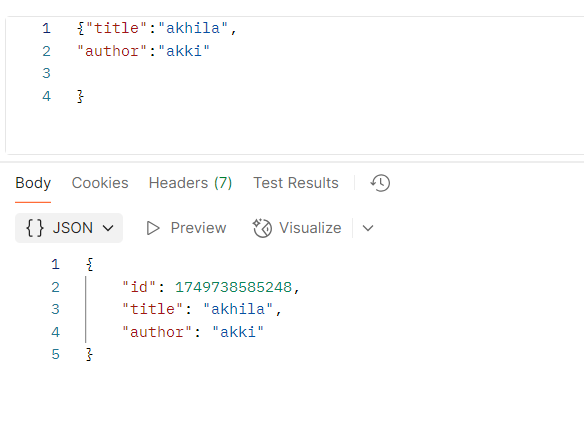
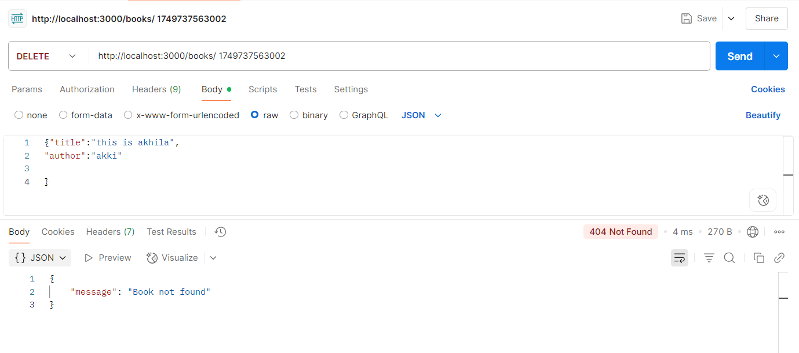

# Simple Book CRUD API

This project is a simple Node.js + Express REST API that allows you to perform basic CRUD operations (Create, Read, Update, Delete) on books. The data is stored in memory (an array), so no database is used.

##  Technologies Used

- Node.js
- Express.js
- Postman (for API testing)

##  Getting Started
 1. Clone the Repository ->
git clone https://github.com/yourusername/task-3.git ->
cd task-3
 2. Install Dependencies ->
npm install
3. Start the Server ->
npm start ->
Server will start at:
---http://localhost:3000

## API Endpoints
### GET All Books
- Endpoint: GET /books
- Purpose: Returns a list of all books.
- Screenshot:

 ### POST a New Book
- Endpoint: POST /books
- Body:json
{
  "title": "kongari akhila",
  "author": "akhila"
}
- Screenshot:

### PUT (Update) a Book
- Endpoint: PUT /books/:id
- Body:json
{
  "title": "akhila",
  "author": "akki"
}

## DELETE a Book
- Endpoint: DELETE /books/:id
- Purpose: Deletes a book with the specified ID.
- Screenshot:

## Notes
Data is stored temporarily in memory and will be lost on server restart.
Make sure to use a valid book ID (from GET /books) for PUT and DELETE requests.

## Author
kongari Akhila

